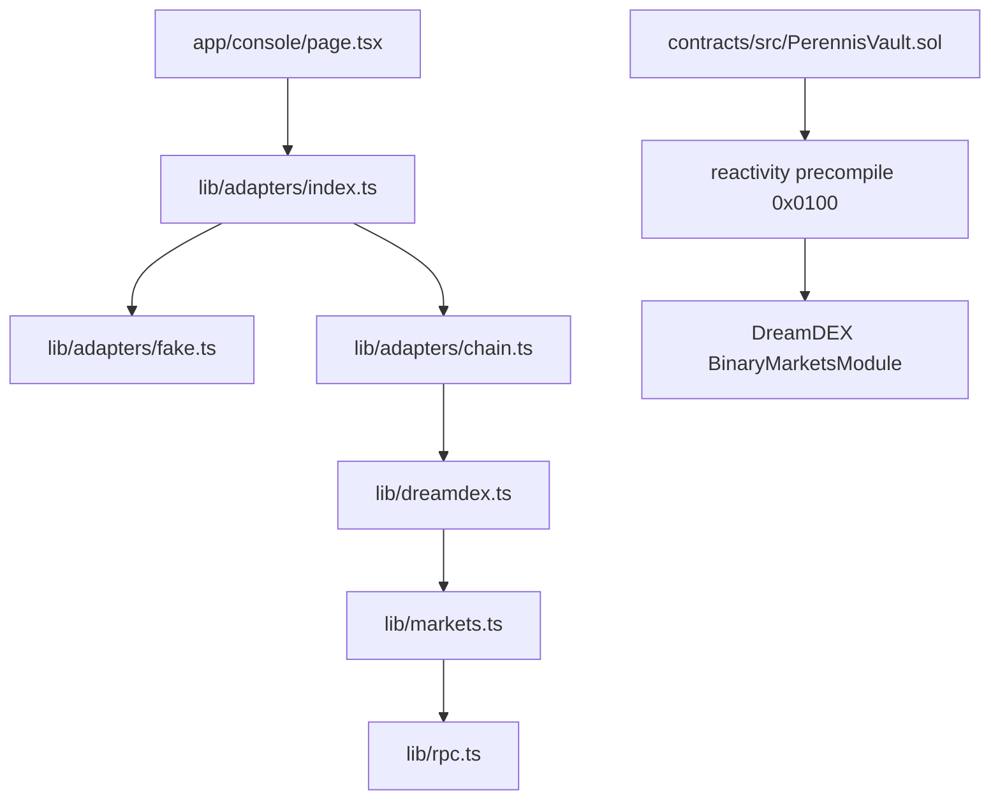

# Perennis

**Stop renewing your Event Contracts position every 15 minutes. Write the plan
once, and the vault redeems and re-enters itself at every settlement with your
stop rules enforced as contract terms.**

## Demo

Four links, with what is actually behind each one. Each row keeps its two claims
apart: the middle column says only whether the thing exists today, and the right
column names only the artefact you open.

| What | Status today | Where |
| --- | --- | --- |
| Live app | Deployed and answering. A probe on 30 August 2026 got 200 back in 298 ms. Whoever submits re-checks it in a cold private window, on the production deployment and not a preview URL, before pasting it on the form. | [perennis-app.vercel.app](https://perennis-app.vercel.app), and straight to the demo at [/console](https://perennis-app.vercel.app/console) |
| Demo video | No take has been recorded. The form field still reads `PENDING, filled by a human before submitting`. | [VIDEO.md](VIDEO.md), the shot list a take follows. It is a script, not a recording: a 2:20 cut, second banded, with a screenshot fallback per band. |
| On chain proof | Not deployed. As of 30 August 2026 every artefact row that needs a chain reads `NOT YET FILLED`. Two scripts produce them: `contracts/script/Deploy.s.sol` for the vault address and the deploy hash, then `contracts/script/Smoke.s.sol` for the deposit hash in row 9. | [EVIDENCE.md](EVIDENCE.md), one row per artefact with its explorer link shape. The live app carries the same addresses in its proof panel at `/#proof`, and `GET /api/health` reports whether the deployment is reading the chain or the fixtures. An address that is not configured says so in words rather than showing a placeholder hash. |
| Security | Contract addresses, every wallet permission this app requests, and the bounded approval amounts. It never asks for `eth_sign` or `personal_sign`, and no wallet dialog opens on page load. | [SECURITY.md](SECURITY.md) |

One field is still a placeholder, and it is the same string in
[SUBMISSION.md](SUBMISSION.md), which is the paste ready DoraHacks form. The live
app link is filled in, here and in the "Live demo link" block there, so two of
the original four copies are gone. What is left is one string, byte identical in
both files: the demo video row above, and the "Demo video link" block there. Grep
the repository for that placeholder before submitting. Two hits means the video
field is still empty in both files, zero means both are done, and one hit means a
file was missed. Replace both copies in the same sitting.

## Try it in 60 seconds

Three lines. No environment file, no wallet, no network.

1. `npm install && npm run dev`
2. Open http://localhost:3000/console
3. Wait for the countdown ring to hit zero and watch the card roll itself

That third line is the whole submission. Nothing is signed, no wallet dialog
opens, and the ledger gains a row. `/console` serves `fixtures/*.json` with an
empty `.env.local`, so the countdown, the roll, the ledger and the queue strip
all work with nothing configured.

## How the pieces connect



`ADAPTER_MODE` picks the left branch. The right branch is the contract's own
path and runs with no frontend involved at all: the precompile calls the vault's
handler in the settlement block, and the vault calls the markets module to
redeem and to buy.

## The problem

DreamDEX Event Contracts open 15 minute and 1 hour windows on BTC and ETH. If you
have a view that lasts an afternoon, there is no way to express it in one
transaction. For every single window you wait for the lock, wait for the resolve,
redeem the winning ERC-6909 outcome token, look up the next window's market id,
and send a new order. Four steps. A four hour view means sixteen repeats.

Miss one round and your capital just sits there as an unredeemed token balance.
So people do one of two things: they trade a single window and leave, or they run
a bot on their laptop that dies when the laptop sleeps.

## The solution

Perennis is a vault contract you deploy and own. You deposit collateral and write
one plan: direction, stake per window, how many windows, and three stop rules.
The same transaction pre-loads the next three market ids into the vault's queue
and opens a Somnia reactivity subscription against the binary markets module.

At the end of every window, validators call the vault's `_onEvent` handler in the
settlement block itself. The vault redeems the resolved position, updates its
streak and PnL counters, checks the stop rules, and if the plan is still live it
takes the next market id off the queue and enters. There is no server in between,
no keeper network, and no process you have to keep alive.

The stop rules are the point. An outcome contract pays 1 or 0, so a rolling plan
without a limit is a martingale with a nicer interface. Three rules sit in the
settlement path as contract conditions:

- consecutive losses, halt after N losing windows in a row
- floor balance, halt if the balance drops to your floor
- take profit, close once the balance reaches your target

When one trips, the contract halts itself and the balance stays in the vault
where you can withdraw it.

## How it uses Somnia and DreamDEX

Three separate layers carry weight, and pulling any of them out breaks the
product rather than degrading it.

| Layer | Where it lives | What it does |
| --- | --- | --- |
| Somnia reactivity precompile `0x0100` | `contracts/src/PerennisVault.sol` | The vault opens its own subscription on `MarketResolved` and implements `ISomniaEventHandler._onEvent`. This is what makes the roll happen in the settlement block with no keeper. |
| DreamDEX BinaryMarketsModule | `contracts/src/PerennisVault.sol`, `lib/dreamdex.ts` | `redeem` converts the winning ERC-6909 outcome token back to collateral, `buy` enters the next window, `marketState` gates the write on lifecycle state 1 (Trading). |
| DreamDEX markets SDK | `lib/markets.ts` | `discoverEventWindows()` calls `loadMarkets()` and keeps what `isBinaryMarket()` accepts, so the window queue is real market ids rather than a list written by hand. Three levels: the SDK, then a per id `getMarket(bytes32)` read, then the fixtures, and `GET /api/health` says which one answered. |
| Chain reads for the console | `lib/dreamdex.ts` | `fetchVaults` reads `snapshot()` and `plan()` off the deployed vault with viem, `fetchRollLedger` builds the whole roll ledger from `RollSettled` logs so every row links to a real Shannon transaction, `fetchEventWindows` delegates to market discovery above, `fetchCollateralDecimals` reads decimals off the token instead of assuming 6. |

Every screen and every API route reads through one interface, `PerennisAdapter`
in `lib/adapters/`. `ADAPTER_MODE=fake` serves the fixtures in `fixtures/`,
`ADAPTER_MODE=real` serves `lib/dreamdex.ts`, which has one function per read
with both paths in the same body: the real chain call when the matching env var
is set, and the fixtures when it is not. That means the console is fully usable
with an empty `.env.local`, and pointing `NEXT_PUBLIC_CONTRACT_ADDRESS` at a
deployed vault switches the same screens onto Shannon without touching a
component. The badge in the console header always says which of the two you are
looking at.

`lib/vault.ts` is a line for line mirror of the contract's settlement path, so
the UI can show you what the vault will do before anything is signed. If you
change a stop rule in one, change it in the other.

## Tracks and how the code earns them

The hackathon published no sponsor bounties. Two rows, one submission that
enters both. `DELIVERY.md` has the deadlines and the pre-submission list.

| Bounty | Prize | Slots | Required tech | Code file | DEMO step |
| --- | --- | --- | --- | --- | --- |
| $5,000 USDso Prize Pool | $5,000 USDso Prize Pool | not published | DreamDEX Event Contracts, Somnia | `lib/markets.ts`, `contracts/src/PerennisVault.sol` | 4 |
| Featured placement in the Somnia Discord showcase series | Featured placement in the Somnia Discord showcase series | not published | DreamDEX Event Contracts, Somnia | `components/standing-plan-console.tsx` (`QueueStrip`) | 7 |

Qualification, in the hackathon's own words: the project must use DreamDEX Event
Contracts meaningfully, and the BUIDL form requires a GitHub link and a demo
video. Judging weights: Innovation and Originality 20%, Technical Implementation
25%, User Experience and Design 20%, Business and Ecosystem Impact 20%,
Presentation and Demo 15%.

The depth test: delete `lib/markets.ts` and DEMO steps 2 and 7 break, because the
open window on the vault card and every id in the queue strip come through
`discoverEventWindows()`.

## Tech stack

- Next.js 15 (App Router), TypeScript strict, Tailwind CSS v4, shadcn primitives
- viem for Somnia Shannon reads (chain 50312, `https://dream-rpc.somnia.network`)
- Solidity 0.8.24, Foundry, one contract with no external imports
- Somnia reactivity precompile `0x0100`, DreamDEX BinaryMarketsModule, ERC-6909
  outcome tokens, tUSDC collateral
- Deploys to Vercel, no server processes and no runtime filesystem writes

The contract's tests are in `contracts/test/PerennisVault.t.sol`, and
[contracts/README.md](contracts/README.md) has a table saying what the first
five assert rather than what their names suggest. Phase 5 added six more, one
per security finding it fixed: checked approve returns, unspent stake credited
back, a measured redeem delta, `startPlan` refused over a live plan, `rescue()`
leaving the tracked balance alone, and `armNext` refusing a zero market id.
`contracts/script/Smoke.s.sol` does one safe real interaction with a deployed
vault (faucet, approve, deposit) and never writes a plan.

## What the console shows

`/console` is one screen, and every part of it is on the demo path. Five things,
top to bottom:

- **The plan builder**, left column. Deposit, direction, stake per window, window
  count, and the three stop rules. `planDefaults` in `lib/data/seed.ts` fills the
  fields, `parsePlanForm()` in `lib/schemas.ts` is the only definition of a valid
  plan, and one signature sends `startPlan`.
- **The live vault card** with the countdown ring (`CountdownRing`,
  `components/standing-plan-console.tsx:1301`): balance, realised PnL, win rate,
  and the open window's entry price, implied probability and book depth. The
  countdown is `DEMO_WINDOW_SECONDS = 20` standing in for a real 15 minute Event
  Contracts window, labelled as a demo clock under the ring. That compressed
  clock is the only thing about the flow that is sped up.
- **The pre-write health strip**, from `preflight()` in `lib/vault.ts`: market
  lifecycle state, the collateral decimals read off the token, and the
  reactivity subscription.
- **The queue strip** (`QueueStrip`, `components/standing-plan-console.tsx:939`),
  naming the next windows the vault will enter with the lifecycle state market
  discovery read for each id. It moves with no click and no signature.
- **The roll ledger timeline**, right column. One row per settled window with its
  outcome, balance, block, a link to the Shannon transaction, and a "validator
  call" badge derived from the transaction sender rather than asserted.

## Quickstart

Five commands. The first three are all you need to see the demo.

```bash
npm install
npm run dev              # http://localhost:3000/console
npm run build            # must stay green
npm run seed             # checks fixtures/*.json, rewrites fixtures/seed-manifest.json
npm run test:contracts   # cd contracts && forge test, needs Foundry installed
```

`cp .env.example .env.local` is optional and everything works without it.
`npm run demo:reset` re-verifies the fixtures and prints the chain reset
commands; `CLAUDE.md` lists it with the rest.

Open http://localhost:3000/console. It has three vaults: an empty one to write a
plan into, one running an eight window BTC plan, and one that halted itself after
two losses in a row. Let the countdown reach zero and watch the card roll with no
signature prompt. The countdown is a 20 second demo clock, labelled as one on
screen, standing in for a real 15 minute window.

To run against the chain, deploy the vault first and fill in
`NEXT_PUBLIC_CONTRACT_ADDRESS` and `NEXT_PUBLIC_BINARY_MARKETS_MODULE`. Build and
deploy commands are in [contracts/README.md](contracts/README.md), including the
`cast` calls for the tUSDC faucet, the deposit, and `startPlan`.

## Running against Shannon

Three env keys flip the whole app from fixtures onto the chain. Put them in
`.env.local` (see `.env.example` for where each value comes from):

```bash
ADAPTER_MODE=real
NEXT_PUBLIC_CONTRACT_ADDRESS=      # the deployed PerennisVault
NEXT_PUBLIC_BINARY_MARKETS_MODULE= # DreamDEX BinaryMarketsModule on Shannon
```

`NEXT_PUBLIC_MARKET_DISCOVERY` picks which level of `lib/markets.ts` runs first
and defaults to `sdk`, which falls through to the per id read and then to the
fixtures on its own. Set it to `seed` to pin the console to fixtures while
recording without a network.

`NEXT_PUBLIC_COLLATERAL_TOKEN` already points at tUSDC and only needs changing
if you move collateral. Nothing else is required, and no key in this app holds a
secret: the deployer key lives behind `FARM_EVM_PRIVATE_KEY`, is used by forge
only, and is read by no file under `app/`, `components/` or `lib/`.

`GET /api/health` is how you check whether the flip took. It reports
`adapterMode`, `chainId`, the collateral `decimals` it actually read,
`vaultAddressSet`, the reactivity precompile address, `rollLedgerSource` and
`marketDiscovery`. Two fields matter most: `rollLedgerSource` says `"chain"` once
the ledger is being built from `RollSettled` logs and `"seed"` while the console
is still on fixtures, and `marketDiscovery.via` says which level of
`lib/markets.ts` produced the window list (`"sdk"` once
`@somnia-chain/markets-sdk` resolves, `"market-ids"` for the per id read,
`"seed"` for the fixtures). `GET /api/rolls` returns the ledger on its own, and
takes an optional `limit` (1 to 12) and `address`.

Every read falls back rather than failing. A missing address, a timeout or a
rejected call comes back as `source: "seed"` with a written reason in `note`,
which the console renders as a badge. There is no error page on this path.

## Running the demo against Shannon

The read path works with nothing filled in. The write path needs a wallet, and
it has to be the right wallet: `startPlan`, `withdraw` and `halt` are
`onlyOwner` on `PerennisVault`, so the browser wallet you connect must be the
address that deployed the contract. Import `FARM_EVM_PRIVATE_KEY` into that
browser wallet, or redeploy the vault from the address you intend to demo with.
`armNext` is the exception: it is permissionless, so any wallet can refill the
queue.

In order:

1. Fill `.env.local`. `ADAPTER_MODE=real`, `NEXT_PUBLIC_CONTRACT_ADDRESS`,
   `NEXT_PUBLIC_BINARY_MARKETS_MODULE`. Two more control the write path:
   `NEXT_PUBLIC_SUBSCRIPTION_FUNDING_STT` (default `0.05`), the native STT the
   `startPlan` transaction carries to fund the reactivity subscription, and
   `NEXT_PUBLIC_TX_CONFIRMATIONS` (default `1`). `.env.example` says where every
   value comes from.
2. Fund the owner address. STT on chain 50312 for gas plus the subscription
   funding above, and tUSDC through `faucet(10000)` on
   `0x70a86D8842FB63C4Ad2b7cdddF530eBf1BB25d8E`.
3. `npm run seed`. Checks `fixtures/*.json` against the invariants the demo walk
   depends on and rewrites `fixtures/seed-manifest.json`.
4. `npm run demo:reset`. Re-verifies the fixture side and prints the exact `cast`
   commands for the chain side (`halt()`, then `withdraw(uint256)`, or a
   redeploy). It never sends a transaction and never holds a key.
5. Walk `DEMO.md` end to end. Check `GET /api/health` first: `adapterMode` reads
   `real`, `vaultAddressSet` is `true`, and `rollLedgerSource` flips to `chain`
   once one settlement has happened.

With a wallet connected on chain 50312 and a vault address set, the console
sends real transactions: approve and deposit, then one `startPlan` that writes
the plan, queues the windows, funds the subscription and enters the first
window. With either half missing it keeps its local path and the wallet strip
says the write was simulated, which is what the deployed demo URL runs on.

## What we would build next

- Take the order book from `fetchOrderBook()` on the markets SDK so implied
  probability moves during the window instead of being the ask at discovery
  time. `lib/markets.ts` already loads the SDK, so this is one more call on a
  module that exists.
- A factory so each user gets their own vault clone from the UI, instead of one
  deploy per person.
- Let a plan follow a spread rather than a fixed side: keep rolling, but pick the
  cheaper leg when the book disagrees with the plan by more than a set margin.
- Subscription gas top up from inside the vault, so a long plan cannot stall
  because the owner's STT ran out mid session.

## Screenshots

One per `DEMO.md` step, captured by a human at 1280 wide, with a 360 wide copy
beside it. They are text links rather than embedded images on purpose: a shot
that has not been captured yet should read as a dead link, not as a broken image
in the middle of this file. [docs/SCREENSHOTS.md](docs/SCREENSHOTS.md) is the
capture list and says what must be in frame for each.

| Step | What it shows | File |
| --- | --- | --- |
| 1 | The plan builder filled in, Vault 01 empty | `docs/step-1.png` |
| 2 | The countdown ring, entry price, implied probability, book depth | `docs/step-2.png` |
| 3 | The pre-write health strip | `docs/step-3.png` |
| 4 | The roll, with no wallet dialog on screen | `docs/step-4.png` |
| 5 | The new ledger row and its validator call badge | `docs/step-5.png` |
| 6 | Vault 03 halted on two losses in a row | `docs/step-6.png` |
| 7 | The queue strip and its lifecycle states | `docs/step-7.png` |
| 8 | The landing masthead with the annotated roll figure, then the dispatch entries and the balance figure | `docs/step-8.png` |
| 9 | The proof panel and `GET /api/health` | `docs/step-9.png` |

## Submitting this

[SUBMISSION.md](SUBMISSION.md) is the DoraHacks BUIDL form, every field in one
paste ready block. [DELIVERY.md](DELIVERY.md) has the deadlines and the
"Before submitting" list a human runs.

## AI use

The Event Contracts Hackathon published no AI policy, so nothing here is a claim
against a rule that does not exist. It is written down because a judge reading
this repository should not have to guess.

AI coding assistants wrote a large share of the code in this repository,
including scaffolding, boilerplate, the component layer and the first draft of
most documentation. The architecture, the product decisions, the contract's
settlement and stop rule semantics, and the final review of every file are the
author's own. Nothing in `EVIDENCE.md` is generated: every row there is a value a
human read off the chain after a real transaction, and a row that has not been
filled in says so.

## License

MIT. The full text is in [LICENSE](LICENSE) at the repository root.

## Status

Testnet software, Shannon only, with tUSDC as collateral. The contract has not
been audited and has no upgrade path. Do not point it at money you care about.
